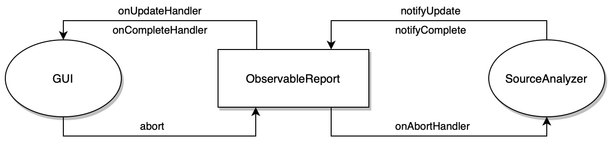
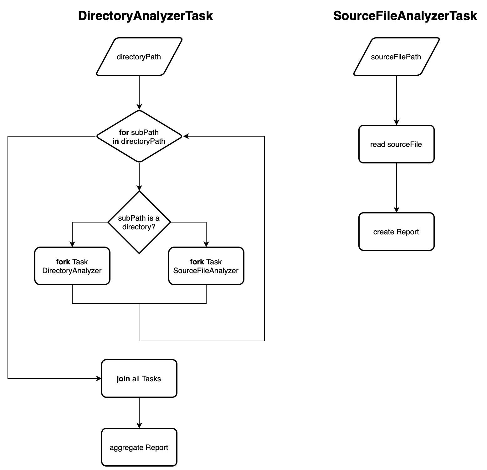

# PCD Assignment 02

## Introduzione

L'obiettivo è quello di affrontare il problema descritto nell'assignment 1, utilizzando quattro diversi approcci di programmazione _asincrona_, descritti di seguito.

Si è deciso di uniformare l'interfaccia degli approcci, sfruttando opportune astrazioni, sia per la versione _CLI_, che per la versione _GUI_.

```java
interface SourceAnalyzer {
    Future<Report> getReport(Directory directory);
    ObservableReport analyzeSources(Directory directory);
}
```

Nel caso di `getReport(Directory directory)`, verrà restituita una _Future_, che sarà completata, in modo asincrono, con il risultato dell'analisi. 
Questo permette, in tutti i casi, di sottomettere la computazione e successivamente attendere il risultato, bloccando opportunamente il Thread che vuole ottenere il risultato.

Un approccio alternativo è quello di aggiungere un _Runnable_ al metodo, che verrà eseguito quando la computazione sarà completata.
Questo permette di non dover attendere un risultato, ma il codice specificato, sarà eseguito al termine del calcolo delle statistiche (e.g una stampa a video del risultato).

Invece, per quanto riguarda `analyzeSources(Directory directory)`, verrà restituito un oggetto osservabile, che permette di registrare, ai due componenti attivi (GUI e SourceAnalyzer), degli _Handler_ agli eventi.

- **GUI**:
    - emette evento di _abort_
    - si sottoscrivere per eventi di _update_ e _complete_
- **SourceAnalyzer**:
    - emette evento di _update_ e _complete_
    - si sottoscrive per eventi di _abort_



## Executor

L'approccio mediante _Executor_ è stato implementato mediante l'utilizzo di un _ForkJoinPool_.
Per la divisione del lavoro, sono stati individuati i seguenti _Recursive Task_:

- **DirectoryAnalyzerTask**:
    1. Partendo da un Path di directory, si analizza il contenuto.
    2. Per ogni elemento:
        - se è un path di Directory, si esegue una _fork_ di un nuovo _DirectoryAnalyzerTask_,
        - se è un path di File, si esegue una _fork_ di un nuovo _SourceFileAnalyzerTask_.
    3. Si esegue _join_ su ogni _fork_.
    4. Si aggregano i risultati.
- **SourceFileAnalyzerTask**:
    1. Partendo da un Path di file, si legge il contenuto.
    2. Si crea il report del file.



## Virtual Threads


## Event Loop

L'approccio a _Event Loop_ è stato implementato utilizzando la libreria [Vertx](https://vertx.io).

## Reactive

