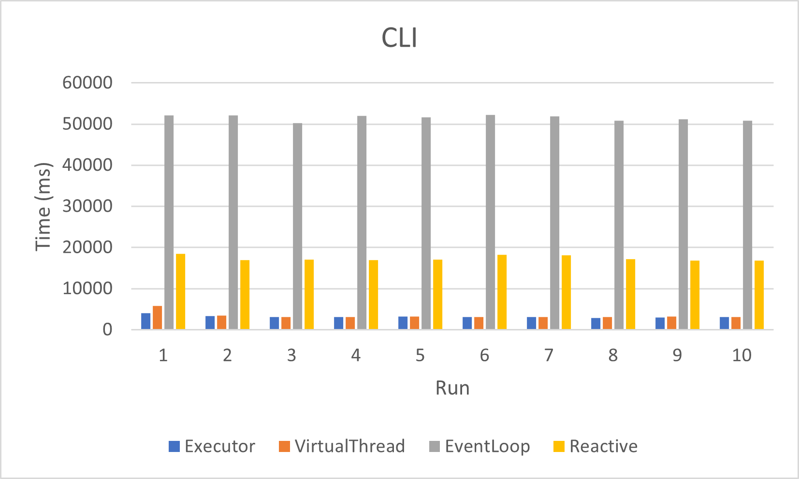
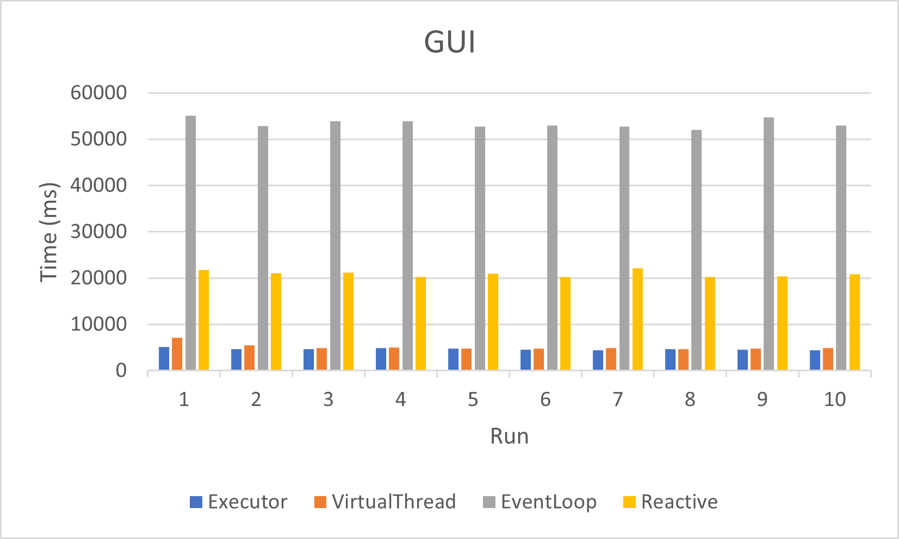

# PCD Assignment 02

Componenti:

- Manuel Andruccioli, manuel.andruccioli@studio.unibo.it
- Kelvin Olaiya,      kelvinoluwada.olaiya@studio.unibo.it

## Introduzione

L'obiettivo è quello di affrontare il problema descritto nell'assignment 1, utilizzando quattro diversi approcci di programmazione _asincrona_, descritti di seguito.

Si è deciso di uniformare l'interfaccia degli approcci, sfruttando opportune astrazioni, sia per la versione _CLI_, che per la versione _GUI_.

```java
interface SourceAnalyzer {
    Future<Report> getReport(Directory directory);
    ObservableReport analyzeSources(Directory directory);
}
```

Nel caso di `getReport(Directory directory)`, verrà restituita una _Future_, che sarà completata, in modo asincrono, con il report dell'analisi. 
Questo permette, in tutti i casi, di sottomettere la computazione e poter successivamente attendere, bloccando opportunamente il Thread che vuole ottenere il risultato.

Un approccio alternativo è quello di aggiungere un _Runnable_ al metodo, che verrà eseguito quando la computazione sarà completata.
Questo permette di non dover attendere un risultato, ma il codice specificato, sarà eseguito al termine del calcolo delle statistiche (e.g una stampa a video del risultato).

Invece, per quanto riguarda `analyzeSources(Directory directory)`, verrà restituito un oggetto osservabile, che permette di registrare, ai due componenti attivi (GUI e SourceAnalyzer), degli _Handler_ agli eventi.

- **GUI**:
    - emette evento di _abort_
    - si sottoscrivere per eventi di _update_ e _complete_
- **SourceAnalyzer**:
    - emette evento di _update_ e _complete_
    - si sottoscrive per eventi di _abort_


## Executor

L'approccio mediante _Executor_ è stato implementato mediante l'utilizzo di un _ForkJoinPool_.
Per la divisione del lavoro, sono stati individuati i seguenti _Recursive Task_:

- **DirectoryAnalyzerTask**:
    1. Partendo da un Path di directory, si analizza il contenuto.
    2. Per ogni elemento:
        - se è un path di Directory, si esegue una _fork_ di un nuovo _DirectoryAnalyzerTask_,
        - se è un path di File, si esegue una _fork_ di un nuovo _SourceFileAnalyzerTask_.
    3. Si esegue _join_ su ogni _fork_.
    4. Si aggregano i risultati.
- **SourceFileAnalyzerTask**:
    1. Partendo da un Path di file, si legge il contenuto.
    2. Si crea il report del file.


Questo approccio facilita la versione _CLI_, permettendo di esplorare ricorsivamente, con gli opportuni `RecursiveTask`, aggregando successivamente i risultati parziali.
Solo alla fine viene viene ritornato il risultato finale.

Invece, per la versione _GUI_, è stato necessario utilizzare _Monitor_, in modo da poter notificare e stampare a video le statistiche incrementate gradualmente.

## Virtual Threads

L'approccio mediante l'utilizzo di _Virtual Threads_ riutilizza l'idea con cui è stata realizzata l'implementazione _Executor_.

La differenza principale è l'utilizzo di un `newVirtualThreadPerTaskExecutor`, i cui task sottomessi sono delle `Callable`.

Anche in questo sono individuate i due task principali:

- **VTDirectoryTask**:
    1. Partendo da un Path di directory, si analizza il contenuto.
    2. Per ogni elemento:
        - se è un path di Directory, si sottomette una _Callable_ _VTDirectoryTask_,
        - se è un path di File, si sottomette una _Callable_ _VTSourceFileTask_.
    3. Si esegue una join sulle _Callable_ e si aggregano i risultati.
- **VTSourceFileTask**:
    1. Partendo da un Path di file, si legge il contenuto.
    2. Si crea il report del file.

Come per l'approccio precedente, anche in questo caso l'implementazione favorisce la versione _CLI_, permettendo di esplorare ricorsivamente, con gli opportuni `Callable`, aggregando successivamente i risultati parziali e minimizzando le corse critiche.

Invece, per la versione _GUI_, viene utilizzato il _Monitor_, come descritto in precedenza.

## Event Loop

L'approccio a _Event Loop_ è stato implementato utilizzando la libreria [Vertx](https://vertx.io).
L'architettura realizzata prevede un singolo _Verticle_ che si occupa di eseguire l'esplorazione ricorsiva delle directory e calcolare il report dell'analisi.
Questo approccio permette di evitare corse critiche, riducendo il codice necessario per la sincronizzazione.

Il flow dell'esecuzione è il seguente:

1. Partendo da un _Path_, viene eseguita una chiamata asincrona per richiedere le sue _props_.
2. Dalle _props_ si può ricavare l'informazione sul _Path_:
    - se è una directory, si esegue una chiamata asincrona per leggerne il contenuto,
    - se è un file, si esegue una chiamata asincrona per leggere il contenuto del file.
3. Al completarsi delle chiamate asincrone:
    - per ogni elemento della directory, si riparte dal punto 1,
    - per il contenuto del file, si crea il report e lo si aggrega al risultato.


Il problema principale di questo approccio è quello di capire quando la computazione è terminata, dal momento che le esecuzioni delle computazioni sono asincrone.
L'implementazione realizzata prevede di mantenere un contatore che viene incrementato ad ogni chiamata asincrona e decrementato al completamento.
In questo modo l'ultima chiamata asincrona decrementerà porta il contatore a 0, permettendo di notificare il completamento della computazione.

Per quanto riguarda l'implementazione della versione _GUI_ viene riutilizzato quasi completamente l'approccio _CLI_, aggiungendo una comunicazione attraverso l'`EventBus` di Vertx.
In questo modo, per terminare la computazione tramite l'interfaccia, è sufficiente inviare un messaggio sul _Bus_, che verrà ricevuto dal _Verticle_.

## Reactive

L'approccio _Reactive_ è stato implementato utilizzando la libreria [RxJava](https://github.com/ReactiveX/RxJava).

La parte principale di questo approccio è la creazione di un `Observable`, che permette di esplorare la directory di partenza.
Ad esso sono aggiunte le opportune operazioni di _Map_ e _Filter_, per ottenere il contenuto dei File e poterli aggregare.

Si è creato un `Observable`, invece che un `Flowable`, poiché lo stream dei files è lazy, così non è necessario gestire il meccanismo di _Backpressure_.

Le differenze tra _CLI_ e _GUI_ sono minime. Nel secondo caso è necessario notificare l'_Observer_ per poter stampare a video i progressi intermedi.

## Performance

Condizioni di testing:

- CPU: Intel Core i7-8700 @ 3.20GHz, 6 Core, 12 Thread
- Folder: [Repo JDK](https://github.com/openjdk/jdk)
- Parametri:
    - maxLines:     1000
    - intervalli:   50
    - longestFiles: 250
- Numero di esecuzioni: 10

### CLI

La soluzione più performante in termini di tempo è quella basata su _Executor_, seguita subito da quella basata su _Virtual Threads_.

Il risultato che l'implementazione a _Event Loop_ è la più lenta era atteso, poiché la computazione è svolta da un singolo thread.

| N. | Executor (ms) | VirtualThread (ms) | EventLoop (ms) | Reactive (ms) |
|----|---------------|--------------------|----------------|---------------|
| 1  |      4077     |        5785        |      52132     |      18412    |
| 2  |      3354     |        3414        |      52171     |      16965    |
| 3  |      3114     |        3072        |      50270     |      17005    |
| 4  |      3044     |        3105        |      51961     |      16907    |
| 5  |      3210     |        3159        |      51622     |      17104    |
| 6  |      3130     |        3070        |      52242     |      18175    |
| 7  |      3036     |        3141        |      51835     |      18094    |
| 8  |      2901     |        3088        |      50788     |      17191    |
| 9  |      2975     |        3235        |      51232     |      16776    |
| 10 |      3141     |        3136        |      50780     |      16813    |
|mean|      3198,2   |        3420,5      |      51503,3   |      17344    |



### GUI

Anche nelle implementazioni per la _GUI_ vediamo un andamento delle performance paragonabile, notando un incremento generale dei tempi di esecuzione.

| N. | Executor (ms) | VirtualThread (ms) | EventLoop (ms) | Reactive (ms) |
|----|---------------|--------------------|----------------|---------------|
| 1  |      5081     |         7155       |      55118     |     21740     |
| 2  |      4684     |         5415       |      52816     |     21099     |
| 3  |      4640     |         4941       |      53943     |     21213     |
| 4  |      4888     |         4946       |      53893     |     20279     |
| 5  |      4717     |         4713       |      52778     |     20931     |
| 6  |      4482     |         4713       |      52957     |     20284     |
| 7  |      4441     |         4885       |      52737     |     22182     |
| 8  |      4670     |         4628       |      52047     |     20236     |
| 9  |      4546     |         4740       |      54733     |     20310     |
| 10 |      4436     |         4859       |      52925     |     20783     |
|mean|      4658,5   |         5099,5     |      53394,7   |     20905,7   |


